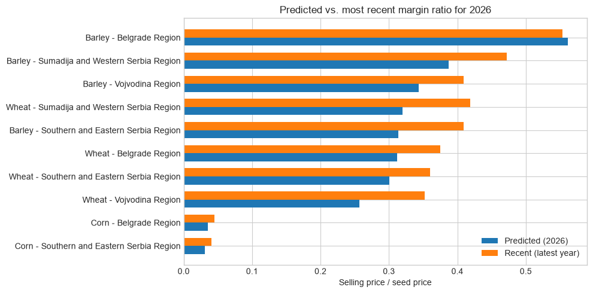

# Grain Market Dynamics in Serbia

**Question:** How have producer margins for wheat, barley, and corn changed
across Serbia's regions since 2010, and where should producers and
policymakers focus attention going forward?

**Data:** STIPS market and seed prices, SORS regional production, 2010-2025,
across Serbia's 4 NUTS2-equivalent regions.

**Method:** Selling-price-to-seed-cost ratios over time, within-year
yield-price correlation (demeaned to strip out inflation/shock trends),
a 5-year linear forecast per region-crop, and a net-margin-per-hectare
ranking. Full pipeline and analysis in `project.ipynb`; see
[How it works](#how-it-works) below for reproduction steps.

## Key Findings

- **Producer margins have narrowed for all three crops since 2010**, and the
  2023-2025 selling-to-seed price ratio is a 15-year low for wheat, barley,
  and corn alike. This looks structural, not a temporary dip.
- **Input-cost inflation, not weak selling prices, is driving the squeeze.**
  Corn's seed price nearly tripled over the period while its market price
  only roughly doubled. Wheat and barley's seed prices roughly doubled while
  their market prices stayed roughly flat.
- **Corn's traditional seed-cost edge over wheat/barley has eroded since
  2021**, as its seed price per hectare rose faster than the other two
  crops'. It's worth rechecking whether corn is still the cheapest crop to
  plant in every region.
- **The 2022 commodity price shock was a temporary reprieve, not a reversal.**
  Margins briefly recovered that year across all three crops before resuming
  their decline.
- **A strong regional harvest tends to coincide with a lower price that same
  year**, most strongly for corn. This pattern only emerges once the shared
  year-to-year price trend (inflation, the 2022 shock) is removed from the
  data; it's relevant to storage and sale-timing decisions, not just
  planting choices.
- **Vojvodina offers the strongest net margin per hectare for corn and
  wheat; Šumadija and Western Serbia for barley.**
- **2026 forecasts point to further margin compression for all three
  crops**, consistent with the trend above, with one exception: Belgrade
  Region's barley forecast is a clear outlier, driven by the region's small
  barley-growing area and correspondingly noisy price history (see below).
  Regions with smaller growing areas generally have noisier price
  histories, so any published forecast for them should carry a
  reliability caveat rather than being taken at face value.

## Main Visualization



**What this means:** Almost every region-crop combination is forecast to sit
below its most recent actual margin in 2026, reinforcing that the 2023-2025
squeeze is a trend rather than a blip. Belgrade Region's barley forecast
breaks that pattern, forecast well above every other combination, but this
isn't a "real" prediction: Belgrade has the smallest barley-growing area of
the four regions, so its 5-year price history is volatile, and a
short linear trend can extrapolate a recent, unrepresentative run of years
into an inflated forecast. Notably, Belgrade's *current* (2024) margin ratio
is already close to the forecast value, so this isn't a wild guess, 
it's a continuation of an already-elevated and possibly unreliable recent level. 
Treat it as a caution about forecast reliability in low-volume regions, not a genuine prediction.

## Policy Takeaways

**For Producers**
- Corn's seed cost edge over wheat/barley has eroded since 2021, as its seed
  price per hectare rose far faster. Recheck whether corn is still the
  cheapest crop to plant in your region.
- Selling-to-seed price margins fell to a 15-year low in 2023-2025 for all
  three crops. Expect thinner margins to persist, not just a temporary dip.
- A strong harvest in your region tends to come with a lower price that
  same year, most for corn. Plan storage and sale timing, not just
  planting, around this.
- Vojvodina offers the strongest net margin for corn and wheat, Šumadija
  and Western Serbia for barley.
- Corn's predicted margins become even lower than the most recent ones
  across all regions, matching the declining trend we've seen. Wheat and
  barley vary more by region, but they are also lower than their most
  recent ones, and Belgrade's barley forecast is the outlier, driven by its
  small growing area.

**For Policy Institutions**
- Corn seed prices nearly tripled while its market price roughly doubled.
  Wheat/barley seed prices roughly doubled, while their market prices
  roughly stayed the same. This means input-cost inflation is the main
  driver of the producer margin squeeze.
- The 2022 price shock only briefly reversed the margin decline for all
  three crops. A one-time spike is not evidence of a lasting improvement.
- A region's price in a given year often reflects how good that year's
  harvest was there compared to other regions. Regional support decisions
  should account for that, not only relying on price trends over time.
- Regions with smaller growing areas have noisier price histories. Any
  published forecast should carry a confidence flag tied to data
  reliability, not just be taken at face value.

## How It Works

### Structure

```
data/
  raw/                               original, unchanged source data (Serbian)
    downloaded_xls/                  STIPS seed-price XLS archive
    Result-130102-300726.csv         SORS export, manually downloaded
    stips_selling_prices_raw.csv      STIPS selling prices raw export
  processed/                         cleaned intermediate outputs (English)
    stips_selling_prices_clean.csv
    stips_seed_prices_clean.csv
    sors_crop_production_clean.csv
  dataset.csv                        final merged dataset (English)
scripts/
  paths.py                           shared paths
  scrape_stips_selling_prices.py     [MANUAL] scrape STIPS selling prices
  scrape_stips_seed_prices.py        [MANUAL] scrape STIPS seed XLS archive
  clean_stips_selling_prices.py      clean raw STIPS selling prices
  clean_stips_seed_prices.py         clean downloaded seed XLS files
  clean_sors_crop_production.py      clean SORS crop production export
  merge_dataset.py                   merge all cleaned outputs
  run_pipeline.py                    run clean_* + merge_dataset.py
project.ipynb                        analysis notebook (reads data/dataset.csv)
requirements.txt
```

### Reproduce (run order)

1. Optional one-time manual scraping (only if raw files are missing or stale):
   ```
   python scripts/scrape_stips_selling_prices.py
   python scripts/scrape_stips_seed_prices.py
   ```
   These steps are intentionally not part of the automatic pipeline because
   they are network-bound and slow.

2. Download `data/raw/Result-130102-300726.csv` manually from:
   [data.stat.gov.rs, indicator 130102](https://data.stat.gov.rs/Home/Result/130102)
   (CSV export with all years, all 4 regions, all 3 crops).

3. Automatic pipeline:
   open `project.ipynb` and run the first cell.
   It checks whether `data/dataset.csv` exists:
   - if it does not exist, it runs `scripts/run_pipeline.py`
   - if it exists, it loads it directly

   Or run manually:
   ```
   python scripts/run_pipeline.py
   ```

## Method Notes

- Region level: SORS NUTS2 equivalent regions:
  Belgrade Region, Vojvodina Region, Sumadija and Western Serbia Region,
  Southern and Eastern Serbia Region.
  STIPS cities are mapped to these regions in `CITY_TO_REGION`
  in `merge_dataset.py`.
- Corn seed pricing conversion (thousand kernel weight = 400 g):
  STIPS corn seed prices are listed per sowing unit (seed count), not per kg.
  Conversion to RSD/kg uses an assumed thousand-kernel weight of 400 g,
  reflecting an observed range of roughly 300-420 g across Serbian and
  regional corn hybrids (varying more by hybrid than by FAO maturity group).
  This is an agronomic approximation. Sources:
  - Institut za ratarstvo i povrtarstvo (Novi Sad) hybrid recommendations,
    reporting thousand-kernel weights of ~390-420 g across NS hybrids
    (FAO 300-700 maturity groups):
    https://fiver.ifvcns.rs/bitstream/id/1726/874.pdf
  - RWA Raiffeisen Agro seed catalog (Croatia, spring 2014), reporting
    thousand-kernel weights of ~300-380 g across commercial hybrids:
    https://rwa.hr/wp-content/uploads/2012/02/rwa-katalog-kukuruz-2014.pdf
  - Axereal MAS Seeds hybrid MAS 56.A, thousand-kernel weight 360-380 g:
    https://www.axereal.rs/seme/mas-seeds/hibridi-kukuruza/mas-56a
  - NS Seme hybrid catalog, thousand-kernel weights ~300-400+ g across
    maturity groups: https://nsseme.com/proizvodi/kukuruz/
- Year shift for wheat/barley seeds:
  wheat and barley are sown in autumn for next-year harvest, so seed purchase
  year is shifted by +1 before merging with SORS harvest-year production.
  Corn (spring sowing) is not shifted.
- Seeding rates (used in `project.ipynb` to convert RSD/kg seed price into a
  seed cost per hectare figure): corn 75,000 seeds/ha (= 3 sowing units,
  converted to ~30 kg/ha using the same 400 g thousand-kernel-weight
  assumption above); wheat 225 kg/ha; barley 190 kg/ha. These are typical,
  representative values, not exact for every hybrid/variety/growing
  condition. Sources:
  - Corn seeding rate (75,000 seeds/ha = 3 sowing units/ha): Serbian
    Ministry of Agriculture regulation on certified-seed subsidies
    (Pravilnik o uslovima, nacinu i obrascu zahteva za ostvarivanje prava
    na regres za sertifikovano seme):
    https://domacinskakuca.rs/2025/05/27/objavljen-pravilnik-o-uslovima-nacinu-i-obrascu-zahteva-za-ostvarivanje-prava-na-regres-za-sertifikovano-seme/
  - Corn seeding rate, independent cross-check (~74,000 seeds/ha average
    across FAO 270-600 hybrids under medium growing conditions; confirms
    "1 sowing unit = 25,000 seeds"): KWS official seeding-rate calculator:
    https://www.kws.com/rs/sr/digitalne-usluge/mykws/potrebna-kolicina-semena/
  - Wheat seeding rate (200-250 kg/ha): Delta Agrar: https://deltaagrar.rs/trgovina-i-distribucija/semena/seme-psenice-i-jecma/
  - Barley seeding rate (140-235 kg/ha, winter/spring varieties):
    - Stovet.rs: https://www.stovet.rs/ratarstvo/seme/jecam/
    - Agroklub.rs (spring barley, 190-235 kg/ha): https://www.agroklub.rs/ratarstvo/koji-je-pravi-recept-prolecne-setve-jarih-zitarica/57639

## Language Policy

- Raw source data under `data/raw/` is kept in original Serbian.
- All processed outputs and final dataset generated by the pipeline are in English.